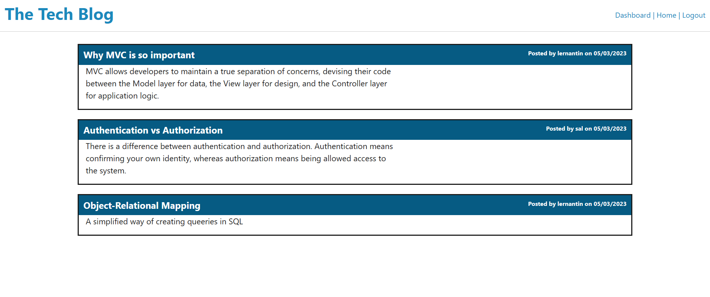

# Tech Blog
  
  ## Description
  This web application is designed to collaborate technology bloggers to come together, share their knowledge through blog posts, and discuss with one another. Existing blog posts and comments are available for viewing to all users.
  Sign up and login function is available for users to access their Dashboard where they can create, update their blogpost, and interact with other bloggers through commenting on other bloggers' posts. 
  Below is a screenshot of the deployed webpage:
  

  ## Table of Contents
  - [Description](#description)
  - [Usage](#usage)
  - [Technology](#technology)
  - [Roadmap](#roadmap)
  - [Contributing](#contributing)
 
  ## Usage
  On the homepage, a list of existing blog posts and its respective author are displayed. You can click on the post title to view if there are any comments attached to each post.
  The Dashboard page allows users to publish, update or delete their blog post. You must be logged in to access the Dashboard, otherwise you'll be redirected the the login page. If you do not have an existing account, sign up option is also available.
  View your current blog posts from Dashboard, and click on the title of the blog post to edit or delete the post.
  Interact with other bloggers through commenting on their posts. 

  ## Technology
  This application requires npm packages: MySQL2, Sequelize and Express packages to connect the MySQL database to API calls. The dotenv package is required to use environment variables to store sensitive data such as MySQL username, password and database name. Bcrypt is used for hashing user passwords, and express-handlebars is used for generating the html pages.
  To test the application on your local machine, you will need to install the packages by entering "npm i" in visual studio command line. Once installed, create the schema from the MySQL shell with the command "mysql -u root -p" followed by your password, then "source schema.sql". Run "npm run seed" to seed the data to your database. Then you are ready to start the application server by running "npm run start". The various API request routes can then be tested in Insomnia.

  ## Roadmap
  I am working on adding new features and functions to the web application. Some of the improvements I am looking to implement in the next update include search functions for filtering through existing blog post by blog topic or keywords to allow better user experience. This will facilitate users to quickly find and view their desired topic easily. We would also like to enable a function that allows logged in users to save a post to favourite, so they can shortlist the posts they would like to view again in the future.
  
  ## Contributing
  If you would like to contribute to this project, head to my GitHub page at https://github.com/Sandy5433/Tech-blog.git to see details of the application code. 
